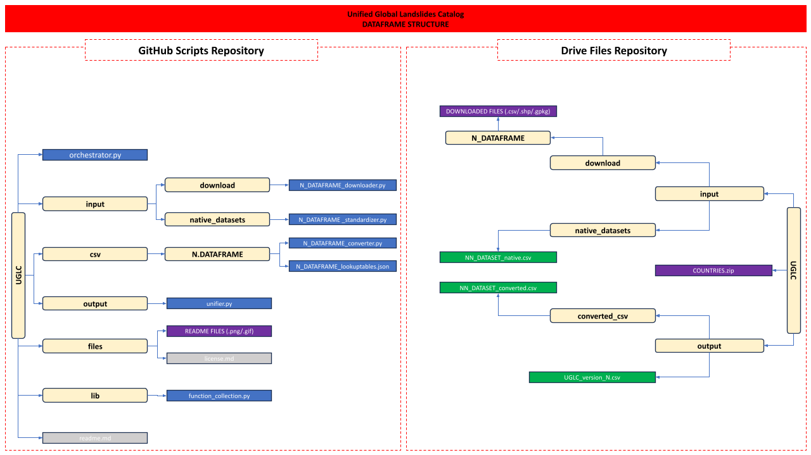

# <p align="center"> UGLC Project </p>
### <p align="center"> "Unified Global Landslides Catalog" </p>

----------------------------------------------------------------------------------------------------------------

----------------------------------------------------------------------------------------------------------------
                                                        IN PROGRESS
----------------------------------------------------------------------------------------------------------------


## :red_circle: Authors

----------------------------------------------------------------------------------------------------------------
- [@Saverio Mancino](https://github.com/RavyHollow) - PhD Student (University of Bari - Dept. Geo-enviromental science).
- [@Anna Sblano](https://github.com/Anita2333) - Researcher (University of Bari - Dept. Geo-enviromental science).
- [@Francesco Paolo Lovergine](https://github.com/fpl) - PhD Researcher (National Research Council of Italy - IREA).
- [@Giuseppe Amatulli](https://github.com/selvaje) - PhD Researcher (Yale University - CRC).
- Domenico Capolongo - PhD Professor (University of Bari - Dept. Geo-enviromental science).

----------------------------------------------------------------------------------------------------------------

## :red_circle: Project description

The main purpose of this project is to generate a single global-scale landslide dataset that collects and standardizes within it all 
global, national, and sub-national landslide catalogs, provided with spatial, temporal, and general information about each event.

----------------------------------------------------------------------------------------------------------------

## :red_circle: License
The whole code is published under the [MIT License](files/LICENSE.txt).

----------------------------------------------------------------------------------------------------------------

## :red_circle: Attribute fields summary

| ATTRIBUTE    | TYPE            |
|--------------|-----------------|
| WKT_GEOM     | Well known text |
| NEW DATASET  | String          |
| ID           | Int             |
| OLD DATASET  | String          |
| OLD ID       | String          |
| VERSION      | String          |
| COUNTRY      | String          |
| ACCURACY     | Int             |
| START DATE   | Date            |
| END DATE     | Date            |
| TYPE         | String          |
| TRIGGER      | String          |
| AFFIDABILITY | Int             |
| RECORD TYPE  | String          |
| FATALITIES   | Int             |
| INJURIES     | Int             |
| NOTES        | String          |
| LINK         | String          |

----------------------------------------------------------------------------------------------------------------

## :red_circle: Attributes description


- <b> WKT_GEOM: </b> The contents of this field contain information about the georeferencing of each point described in the dataframe using the WGS84 reference system.


- <b> NEW DATASET: </b> the content of this field represents the name of the new dataframe's identifying abbreviation: "UGLC".


- <b> ID: </b> the content of this field contains a unique ID for each landslide event included into the UGLC dataset.


- <b> OLD DATASET: </b> the contents of this field represent the name of the native dataset used into the UGLC creation:

    |POINT DATASET|
    |-------------|
  
    | REFERING                                                                                                                                            | NAME                                                                                           | N° POINTS | LICENSE                                                                                                              | DOWNLOAD  | IMPLEMENTED          |
    |-----------------------------------------------------------------------------------------------------------------------------------------------------|------------------------------------------------------------------------------------------------|-----------|----------------------------------------------------------------------------------------------------------------------|-----------|----------------------|
    | [01_COOLR](https://maps.nccs.nasa.gov/arcgis/apps/MapAndAppGallery/index.html?appid=574f26408683485799d02e857e5d9521)                               | Cooperative Open Online Landslide Repository (NASA) Event + Report points (with no duplicates) | 49718     | [LICENSE](https://maps.nccs.nasa.gov/arcgis/apps/MapAndAppGallery/index.html?appid=574f26408683485799d02e857e5d9521) | free      | :heavy_check_mark:   |
    | [02_GFLD](https://nhess.copernicus.org/articles/18/2161/2018/)                                                                                      | Global fatal landslide occurrence from 2004 to 2016                                            | 5490      | [LICENSE](https://creativecommons.org/licenses/by/4.0/legalcode)                                                     | free      | :heavy_check_mark:   |
    | [03_ITALICA](https://zenodo.org/records/8009366)                                                                                                    | ITAlian rainfall-induced LandslIdes CAtalogue (CNR - IRPI)                                     | 6312      | [LICENSE](https://creativecommons.org/licenses/by/4.0/legalcode)                                                     | free      | :heavy_check_mark:   |
    | [04_UAP](https://www.sciencebase.gov/catalog/item/61f326dfd34e622189b93308)                                                                         | Landslide Inventories across the United States version2 (USGS)                                 | 176427    | [LICENSE](https://www.usgs.gov/emergency-operations-portal/copyright-and-data-citation)                              | free      | :heavy_check_mark:   |
    | [05_ALC](https://oasishub.co/dataset/australia-landslide-catalogue)                                                                                 | Australia Landslide Catalogue                                                                  | 1653      | [LICENSE](https://opendefinition.org/licenses/cc-by/)                                                                | free      | :heavy_check_mark:   |
    | [06_PCLD](https://doi.org/10.5281/zenodo.10271431)                                                                                                  | Preliminary Canadian Landslide Database                                                        | 8302      | [LICENSE](https://creativecommons.org/licenses/by/4.0/legalcode)                                                     | free      | :heavy_check_mark:   |
    | [07_RBR](https://esurf.copernicus.org/articles/9/445/2021/)                                                                                         | Shallow Landslide Inventory for 2000-2019 (eastern DRC, Rwanda, Burundi)                       | 7945      | [LICENSE](https://creativecommons.org/licenses/by/4.0/legalcode)                                                     | free      | :heavy_check_mark:   |
    | [08_NZK](https://www.designsafe-ci.org/data/browser/public/designsafe.storage.published/PRJ-2765/#details-6410851737832919531-242ac118-0001-012)    | Map of co-seismic Landslides for the 7.8 Kaikoura earthquake, New Zealand                      | 7355      | [LICENSE](https://opendatacommons.org/licenses/by/summary/)                                                          | free      | :heavy_check_mark:   |
    | [09_CA](https://geohazards.com.co/visor-geohazard.html)                                                                                             | Mass Movements Information System (SIMMA) of the Colombian Geological Service                  | 1065      | [LICENSE]()                                                                                         | free      | :heavy_check_mark:   |
    | [10_BGS](https://www.bgs.ac.uk/geology-projects/landslides/national-landslide-database/a-guide-to-the-national-landslide-database-on-the-geoindex/) | National Landslide Database - Index data (BGS)                                                 | 15050     | [LICENSE](https://www.nationalarchives.gov.uk/doc/open-government-licence/version/3/)                                | on demand | :heavy_check_mark:   |
    | [11_NTMI](https://data.gov.ie/dataset/gsi-landslide-events-data)                                                                                    | Landslide Events Data (GSI)                                                                    | 2811      | [LICENSE](https://creativecommons.org/licenses/by/4.0/)                                                              | free      | :heavy_check_mark:   |
    | [12_VLS](https://anrgeodata.vermont.gov/datasets/landslides/explore?location=43.920513%2C-72.678150%2C8.82)                                         | Vermont Geological Survey's preliminary landslide inventory                                    | 3049      | [LICENSE](https://creativecommons.org/licenses/by/4.0/)                                                              | free      | :heavy_check_mark:   |
    | [13_SLIDO](https://www.oregon.gov/dogami/slido/Pages/data.aspx)                                                                                     | Statewide Landslide Information Database for Oregon (DOGAMI)                                   | 15866     | [LICENSE](https://creativecommons.org/licenses/by/4.0/)                                                              | free      | :heavy_check_mark:   |
    | [14_1N](https://www.fdsn.org/networks/detail/1N_2015/)                                                                                              | 1N (2015-2027): French Landslide Observatory – OMIV (Temporary data)                           | 194       | [LICENSE](https://creativecommons.org/licenses/by/4.0/)                                                              | free      | :heavy_check_mark:   |
    | [15_CAFLAG](https://data.4tu.nl/articles/dataset/CAmpi_Flegrei_LAndslide_Geodatabase_CAFLAG_/14440757)                                              | The CAmpi Flegrei LAndslide Geodatabase                                                        | 2302      | [LICENSE](https://creativecommons.org/licenses/by/4.0/)                                                              | free      | :heavy_check_mark:   |
    | [16_ETGFI](https://www.sciencebase.gov/catalog/item/583f4114e4b04fc80e3c4a1a)                                                                       | ETGFI - Earthquake-Triggered Ground-Failure Inventories (POINTS) - USGS                        | 115402    | [LICENSE](https://creativecommons.org/licenses/by/4.0/)                                                              | free      | :heavy_check_mark:   |
    | [17_IFFI](https://idrogeo-isprambiente-it.translate.goog/app/page/open-data?_x_tr_sl=en&_x_tr_tl=it&_x_tr_hl=it&_x_tr_pto=sc&_x_tr_hist=true)                                                                   | IFFI - Inventario fenomeni franosi in Italia (ISPRA)                                | 622447    | [LICENSE]([https://maps.nccs.nasa.gov/arcgis/apps/MapAndAppGallery/index.html?appid=574f26408683485799d02e857e5d9521](https://creativecommons.org/licenses/by/4.0/legalcode)                                                              | free      | :heavy_check_mark:   |


- <b> OLD ID: </b> the contents of this field represent the identifying id assigned to this row in the source dataset (if any)


- <b> VERSION: </b> the contents of this field represent the latest updated version of the original dataset used (if specified)


- <b> COUNTRY: </b> the content of this field represents the country where the event was located (where missing it was derived using its coordinates


- <b> ACCURACY: </b> the content of this field represents the precision in meters of the relative deviation of the georeferenced point from 
    the actual landslide (if there is one), where the NaN values or the spatially uncertain points are represented by the value -99999


- <b> START DATE: </b> the contents of this field represent the date of the event (if specified exactly in the source dataset) 
    and in that case it will coincide with the END DATE field (format:ISO 8601:YYYY/MM/DD).
    In case the date of the event is not present or clearly explicit, this field will contain the start date of the acquisition gap 
    of the information in the dataset, thus specifying its uncertainty
    In addition. for events where the start date could not be derived and for events that began before 1677/12/31, the start date
    was set as 1677/12/31.


- <b> END DATE: </b> the contents of this field represent the date of the event (if specified exactly in the source dataset) 
    and in that case it will coincide with the START DATE field (format:ISO 8601:YYYY/MM/DD).
    In case the date of the event is not present or clearly explicit, this field will contain the end date of the acquisition gap 
    of the information in the dataset, thus specifying its uncertainty.


- <b> TYPE: </b> the content of this field represents the kinematic type of the landslide event (if explicit), standardized using this reference table: 
  
    | LANDSLIDE CATEGORY           |
    |------------------------------|
    | <i>(description)</i>         |
    | complex                      |
    | soil creep                   | 
    | debris flow                  |  
    | earth flow                   |
    | lahar                        |
    | earth slide                  |
    | mudslide                     |
    | riverbank collapse           |
    | rock slide                   |
    | rock fall                    |
    | rotational sliding           |
    | translational sliding        |
    | snow avalanche               |
    | earth spreading              |
    | rock spreading               |
    | glacial lake outburst floods |
    | mud flow                     |
    | sinkhole                     |
    | liquefaction                 |
    | ND                           |


- <b> TRIGGER: </b> the content of this field represents the trigger that triggered the landslide event (if explicit), standardized using this reference table:
  
    | TYPE OF TRIGGER                                | IDENTIFYING ABBREVIATION |
    |------------------------------------------------|--------------------------|
    | <i>(description)</i>                           | <i>(value)</i>           | 
    | Rainfall trigger                               | rainfall                 | 
    | Seismic trigger                                | seismic                  | 
    | Volcanic trigger                               | volcanic                 |  
    | Human-induced trigger                          | human                    | 
    | Climate temperatures trigger                   | climate                  | 
    | Postfire trigger                               | postfire                 |
    | Deforestation processes                        | deforestation            |
    | Erosional/gravitational and biological trigger | natural                  | 
    | Unknown                                        | ND                       | 


- <b> AFFIDABILITY: </b> the content of this field represents the reliability of the data based on a decision table that takes into 
    account spatial accuracy (ACCURACY) and temporal accuracy (START DATE, END DATE):

    | SPATIAL AFFIDABILITY   | TEMPORAL AFFIDABILITY          | AFFIDABILITY DESCRIPTION         | CLASS          |
    |------------------------|--------------------------------|----------------------------------|----------------|
    | <i>(meters)</i>        | <i>(START DATE = END DATE)</i> | <i>(Description)</i>             | <i>(value)</i> |
    | ( <100 m )             | TRUE                           | Exact point                      | 1              | 
    | ( <100 m )             | FALSE                          | Almost exact point               | 2              |
    | ( >100 m and <250 m )  | TRUE                           | Very high reliability point      | 3              | 
    | ( >100 m and <250 m )  | FALSE                          | High reliability point           | 4              |  
    | ( >250 m and <500 m )  | TRUE                           | Medium reliability point         | 5              |
    | ( >250 m and <500 m )  | FALSE                          | Low reliability point            | 6              | 
    | ( >500 m and <1000 m ) | TRUE                           | Very low reliability point       | 7              | 
    | ( >500 m and <1000 m ) | FALSE                          | Poor reliability point           | 8              |
    | ( >1000 m )            | TRUE and FALSE                 | Point with uncertain reliability | 9              | 
    | ( -99999)              | TRUE and FALSE                 | Unreliable point                 | 10             | 


- <b> RECORD TYPE: </b>  The contents of this field contain information regarding the record type: <u>report</u>, 
    <u>event</u>.
    
    - Report catalogs are usually landslide reports that typically collect a lot of detailed technical information 
    about individual landslide events.
  
    - Event catalogs, on the other hand, generally focus on summarizing landslide events 
    triggered by episodic events (such as heavy rains, earthquakes, eruptions, etc.) with less technical information and 
    more statistical details, without delving into the specifics of each event.


- <b> FATALITIES: </b> the content of this field contains the number of fatalities related to the event (if explicit), where the NaN values are represented by the value -99999
  

- <b> INJURIES: </b> the content of this field contains the number of injuries related to the event (if explicit), where the NaN values are represented by the value -99999


- <b> NOTES: </b> the content of this field contains the notes and information relate to the event (if explicit)


- <b> LINKS: </b>  the content of this field contains the link to the source of the event report or study (if explicit)

--------------------------------------------------------

## :red_circle: Folder Structure


--------------------------------------------------------

<p align="center"><i> Folder Structure Scheme </i></p>

--------------------------------------------------------


The entire UGLC structure is allocated in 2 main repositories:
- GitHub Scripts Repository (GSR)
- Drive Files Repository (DFR)

The GSR contains 5 main folders :
- input
  This folder contains the "download" and "native_datasets" folders. The first one contains the downloader scripts
  ("N_DATAFRAME_downloader.py"), one for each dataset, that manage the automatic download of the native datasets
  (as .csv/.shp/.gpkg etc) from the source sites (Entities, Government agencies, Universities, Various repositories
  etc.) and save them into the DFR download folder.
  The second folder contains standardizer scripts ("N_DATAFRAME_standardizer.py") wich read the downloaded files into
  the DFR creating a standardized .csv ready to be converted into the UGLC format, and save it ("N_DATAFRAME_native.csv")
  into the DFR native_dataset folder.

- csv

  This folder contains one folder named after each different native datasets ("N_DATAFRAME") contains the converter script
  ("N_DATAFRAME_converter.py") and the lookup tables ("NN_DATAFRAME_lookuptables.json") which read the native datasets from
  the DFR, then filter and convert each native datasets into the UGLC standard using also the functions from the lib folder,
  and save them ("N_DATAFRAME_converted.csv") into the DFR output/converted_csv folder.

- output

  This folder contains the unifier script ("unifier.py") that read the converted datasets from the DFR output/converted_csv
  folderand and merge all converted and standardized datasets, generating the final UGLC dataframe ("UGLC_version_N.csv"),
  saving it into the DFR output folder.
  
- lib

  This folder contains the functions script ("function_collection.py") wich are called from the converter scripts into the
  GPR for various data conversion.

- files
  This folder contains all the files used by this readme file, like pictures and the license.
  
All the scripts are managed by the "orchestrator.py" master script in the main folder.
Into the main folder there is also this readme file wich contains all this informations and the pictures of the UGLC 
dataframe.

--------------------------------------------------------
## :red_circle: Requirements

Specificare gli eventuali requisiti hardware o software necessari per eseguire gli script. Ad esempio:

- Python 3.11 o versioni successive
- Altri moduli o librerie specifici

----------------------------------------------------------------------------------------------------------------
                                                        IN PROGRESS
----------------------------------------------------------------------------------------------------------------

--------------------------------------------------------
## :red_circle: Installation

Spiegare come installare eventuali dipendenze o configurare l'ambiente di lavoro per eseguire gli script.

----------------------------------------------------------------------------------------------------------------
                                                        IN PROGRESS
----------------------------------------------------------------------------------------------------------------

```bash
pip install -r requirements.txt
