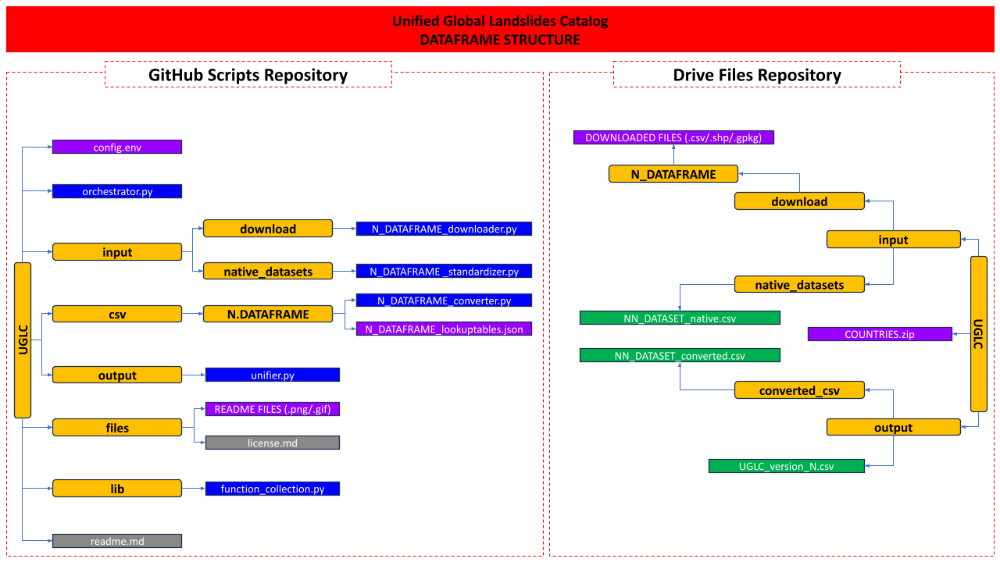

- - -
# 
 UNIFIED GLOBAL LANDSLIDE CATALOGUE

## 
 Point catalogue 

----------------------------------------------------------------------------------------------------------------

## :red_circle: Authors

----------------------------------------------------------------------------------------------------------------
- [@Saverio Mancino](https://github.com/RavyHollow) - PhD Student (Dept. Geo-enviromental science - University of Bari).
- [@Anna Sblano](https://github.com/Anita2333) - Research Fellow (Dept. Geo-enviromental science - University of Bari).
- [@Francesco Paolo Lovergine](https://github.com/fpl) - Researcher (Institute for the Electromagnetic Survey of the Atmosphere - National Research Council of Italy).
- [@Giuseppe Amatulli](https://github.com/selvaje) - PhD Researcher (School of the Environment - Yale University).
- Domenico Capolongo - PhD Professor (Dept. Geo-enviromental science - University of Bari).

----------------------------------------------------------------------------------------------------------------

## :red_circle: Project description

The main purpose of this project is to generate a single global-scale landslide dataset that collects and standardizes 
within it all open source global, national, and sub-national landslide datasets, provided with spatial and temporal 
accuracy details, along with several general information about each single record.

----------------------------------------------------------------------------------------------------------------

## :red_circle: License
The whole code is published under the [MIT License](files/LICENSE.txt).

----------------------------------------------------------------------------------------------------------------

## :red_circle: Publication Notice
The catalogue, along with its associated analyses, methodologies, and results, is planned for publication by Summer 2025.\
This release will include comprehensive documentation and datasets, making the information fully accessible to the 
scientific community and the public.\
Stay tuned for updates as we approach the release date.

----------------------------------------------------------------------------------------------------------------

## :red_circle: Data availability
The catalogues data available in these googledrive repositories are distributed under the licence [Creative Commons Attribution 4.0 International (CC BY 4.0)](https://creativecommons.org/licenses/by/4.0/) 

- [UGLC Point Catalogue](https://drive.google.com/drive/folders/1Vj0yNB488g2bhAlrlug_8xoyZsgazn6t?usp=sharing)
- [UGLC Polygonal Catalogue](https://drive.google.com/drive/folders/1-0yvEdZmx0iwCRC8c-RowXHr8nmXtR9O?usp=sharing)

----------------------------------------------------------------------------------------------------------------

## :red_circle: Attribute fields summary

| ATTRIBUTE        | TYPE            |
|------------------|-----------------|
| WKT_GEOM         | Well known text |
| NEW DATASET      | String          |
| ID               | Int             |
| OLD DATASET      | String          |
| OLD ID           | String          |
| VERSION          | String          |
| COUNTRY          | String          |
| ACCURACY         | Int             |
| START DATE       | Date            |
| END DATE         | Date            |
| TYPE             | String          |
| PHYSICAL FACTORS | String          |
| RELIABILITY      | Int             |
| RECORD TYPE      | String          |
| FATALITIES       | Int             |
| INJURIES         | Int             |
| NOTES            | String          |
| LINK             | String          |

----------------------------------------------------------------------------------------------------------------

## :red_circle: Attributes description

- <b> WKT_GEOM: </b> The contents of this field contain information about the georeferencing of each point described in the dataframe using the WGS84 reference system.

- <b> NEW DATASET: </b> the content of this field represents the name of the new dataframe's identifying abbreviation: "UGLC".

- <b> ID: </b> the content of this field contains a unique ID for each landslide event included into the UGLC dataset.

- <b> OLD DATASET: </b> the contents of this field represent the name of the native dataset used into the UGLC creation:

    |POINT DATASET|
    |-------------|
  
    | REFERING                                                                                                                                            | NAME                                                                                           | N° POINTS | LICENSE                                                                                                              | DOWNLOAD  | IMPLEMENTED          |
    |-----------------------------------------------------------------------------------------------------------------------------------------------------|------------------------------------------------------------------------------------------------|-----------|----------------------------------------------------------------------------------------------------------------------|-----------|----------------------|
    | [01_COOLR](https://maps.nccs.nasa.gov/arcgis/apps/MapAndAppGallery/index.html?appid=574f26408683485799d02e857e5d9521)                               | Cooperative Open Online Landslide Repository (NASA) Event + Report points (with no duplicates) | 49718     | [LICENSE](https://maps.nccs.nasa.gov/arcgis/apps/MapAndAppGallery/index.html?ppid=574f26408683485799d02e857e5d9521) | free      | :heavy_check_mark:   |
    | [02_GFLD](https://nhess.copernicus.org/articles/18/2161/2018/)                                                                                      | Global fatal landslide occurrence from 2004 to 2016                                            | 5490      | [LICENSE](https://creativecommons.org/licenses/by/4.0/legalcode)                                                     | free      | :heavy_check_mark:   |
    | [03_ITALICA](https://zenodo.org/records/8009366)                                                                                                    | ITAlian rainfall-induced LandslIdes CAtalogue (CNR - IRPI)                                     | 6312      | [LICENSE](https://creativecommons.org/licenses/by/4.0/legalcode)                                                     | free      | :heavy_check_mark:   |
    | [04_UAP](https://www.sciencebase.gov/catalog/item/61f326dfd34e622189b93308)                                                                         | Landslide Inventories across the United States version2 (USGS)                                 | 176427    | [LICENSE](https://www.usgs.gov/emergency-operations-portal/copyright-and-data-citation)                              | free      | :heavy_check_mark:   |
    | [05_ALC](https://oasishub.co/dataset/australia-landslide-catalogue)                                                                                 | Australia Landslide Catalogue                                                                  | 1653      | [LICENSE](https://opendefinition.org/licenses/cc-by/)                                                                | free      | :heavy_check_mark:   |
    | [06_PCLD](https://doi.org/10.5281/zenodo.10271431)                                                                                                  | Preliminary Canadian Landslide Database                                                        | 10134     | [LICENSE](https://creativecommons.org/licenses/by/4.0/legalcode)                                                     | free      | :heavy_check_mark:   |
    | [07_RBR](https://esurf.copernicus.org/articles/9/445/2021/)                                                                                         | Shallow Landslide Inventory for 2000-2019 (eastern DRC, Rwanda, Burundi)                       | 7945      | [LICENSE](https://creativecommons.org/licenses/by/4.0/legalcode)                                                     | free      | :heavy_check_mark:   |
    | [08_NZK](https://www.designsafe-ci.org/data/browser/public/designsafe.storage.published/PRJ-2765/#details-6410851737832919531-242ac118-0001-012)    | Map of co-seismic Landslides for the 7.8 Kaikoura earthquake, New Zealand                      | 7355      | [LICENSE](https://opendatacommons.org/licenses/by/summary/)                                                          | free      | :heavy_check_mark:   |
    | [09_CA](https://geohazards.com.co/visor-geohazard.html)                                                                                             | Mass Movements Information System (SIMMA) of the Colombian Geological Service                  | 1065      | [LICENSE]()                                                                                         | free      | :heavy_check_mark:   |
    | [10_BGS](https://www.bgs.ac.uk/geology-projects/landslides/national-landslide-database/a-guide-to-the-national-landslide-database-on-the-geoindex/) | National Landslide Database - Index data (BGS)                                                 | 15050     | [LICENSE](https://www.nationalarchives.gov.uk/doc/open-government-licence/version/3/)                                | on demand | :heavy_check_mark:   |
    | [11_NTMI](https://data.gov.ie/dataset/gsi-landslide-events-data)                                                                                    | Landslide Events Data (GSI)                                                                    | 2811      | [LICENSE](https://creativecommons.org/licenses/by/4.0/)                                                              | free      | :heavy_check_mark:   |
    | [12_VLS](https://anrgeodata.vermont.gov/datasets/landslides/explore?location=43.920513%2C-72.678150%2C8.82)                                         | Vermont Geological Survey's preliminary landslide inventory                                    | 3049      | [LICENSE](https://creativecommons.org/licenses/by/4.0/)                                                              | free      | :heavy_check_mark:   |
    | [13_SLIDO](https://www.oregon.gov/dogami/slido/Pages/data.aspx)                                                                                     | Statewide Landslide Information Database for Oregon (DOGAMI)                                   | 15378  | [LICENSE](https://creativecommons.org/licenses/by/4.0/)                                                              | free      | :heavy_check_mark:   |
    | [14_1N](https://www.fdsn.org/networks/detail/1N_2015/)                                                                                              | 1N (2015-2027): French Landslide Observatory – OMIV (Temporary data)                           | 194       | [LICENSE](https://creativecommons.org/licenses/by/4.0/)                                                              | free      | :heavy_check_mark:   |
    | [15_CAFLAG](https://data.4tu.nl/articles/dataset/CAmpi_Flegrei_LAndslide_Geodatabase_CAFLAG_/14440757)                                              | The CAmpi Flegrei LAndslide Geodatabase                                                        | 2302      | [LICENSE](https://creativecommons.org/licenses/by/4.0/)                                                              | free      | :heavy_check_mark:   |
    | [16_ETGFI](https://www.sciencebase.gov/catalog/item/583f4114e4b04fc80e3c4a1a)                                                                       | ETGFI - Earthquake-Triggered Ground-Failure Inventories (POINTS) - USGS                        | 115402    | [LICENSE](https://creativecommons.org/licenses/by/4.0/)                                                              | free      | :heavy_check_mark:   |
    | [17_IFFI](https://idrogeo-isprambiente-it.translate.goog/app/page/open-data?_x_tr_sl=en&_x_tr_tl=it&_x_tr_hl=it&_x_tr_pto=sc&_x_tr_hist=true)       | IFFI - Inventario fenomeni franosi in Italia (ISPRA)                                           | 622447    | [LICENSE](https://creativecommons.org/licenses/by/4.0/)                                                              | free      | :heavy_check_mark:   |

- <b> OLD ID: </b> the contents of this field represent the identifying id assigned to this row in the source dataset (if any)

- <b> VERSION: </b> the contents of this field represent the latest updated version of the original dataset used (if specified)

- <b> COUNTRY: </b> the content of this field represents the country where the event was located (where missing it was derived using its coordinates)

- <b> ACCURACY: </b> the content of this field represents the precision in meters of the relative deviation of the geo-referenced point from 
    the actual landslide (if there is one), where it is not clearly specified is inferred based on the information present in the record. 
    While the total absence of accuracy information becomes a NaN value for identify spatially uncertain records, represented by the value '-99999'.

- <b> START DATE: </b> the contents of this field represent the date of the record (if specified exactly in the source dataset) 
    and in that case it will coincide with the END DATE field (format:ISO 8601:YYYY/MM/DD).
    In case the record date is not present or clearly explicit, this field will contain the start date of the dataset acquisition time range;
    so the date inside this field will not be coincident with the END DATE field, implying the temporal uncertainty of that record.
    In case of records where start date could not be derived at all, or if the record start date is before '1677/12/31', this field will be 
    set as '1678/01/01' due to pandas time limit.

- <b> END DATE: </b> the contents of this field represent the date of the record (if specified exactly in the source dataset) 
    and in that case it will coincide with the START DATE field (format:ISO 8601:YYYY/MM/DD).
    In case the record date is not present or clearly explicit, this field will contain the end date of the dataset acquisition time range;
    so the date inside this field will not be coincident with the START DATE field, implying the temporal uncertainty of that record.

- <b> TYPE: </b> Contains information about the geological and kinematic type of the landslide record, standardized using
    the extended classification of Varnes including also other common gravitational surface instability phenomena (Hungr et al., 2014).
    These type categories are standardized using this reference table: 
  
    | LANDSLIDE CATEGORY           |
    |------------------------------|
    | <i>(description)</i>         |
    | complex                      |
    | soil creep                   | 
    | debris flow                  |  
    | earth flow                   |
    | lahar                        |
    | earth slide                  |
    | mudslide                     |
    | riverbank collapse           |
    | rock slide                   |
    | rock fall                    |
    | rotational sliding           |
    | translational sliding        |
    | earth spreading              |
    | rock spreading               |
    | mud flow                     |
    | sinkhole                     |
    | ND                           |

- <b>PHYSICAL FACTORS:</b> This field encompasses the physical factors contributing actively to the landslide activation, categorized 
    into predisposing (PR), preparatory (P) and triggering (T) factors. Predisposing factors include invariant characteristics 
    such as geology, topography, and land use; preparatory factors refer to monitorable cyclical changes like seasonal variations 
    in saturation, weathering, or fire-induced alterations while triggering factors involve impulsive events such as 
    earthquakes, intense rainfall, or volcanic activity. 
    The category of Predisposing factors (PR) was not considered in our classification because it was absent in the native 
    data. Therefore, only the categories of Preparatory (P) and Triggering (T) factors were considered in the classification 
    of physical factors of landslides in this catalog.
    These categories are standardized using this reference table:
  
    | PHYSICAL FACTORS                        | IDENTIFYING ABBREVIATION |
    |-----------------------------------------|--------------------------|
    | <i>(description)</i>                    | <i>(value)</i>           | 
    | Rainfall activity                       | rainfall (T)             | 
    | Seismic activity                        | seismic (T)              | 
    | Volcanic activity                       | volcanic (T)             |  
    | Human-induced factors                   | anthropic (T,P)          | 
    | Climatic factors                        | climate (T,P)            | 
    | Post-fire conditions                    | postfire (P)             |
    | Post-deforestation processes conditions | deforestation (P)        |
    | Erosional and biological factors        | natural (T,P)            | 
    | Not defined                             | ND                       | 

- <b> RELIABILITY: </b> the content of this field represents the reliability of the data based on a decision table that takes into 
    account spatial accuracy (ACCURACY) and temporal accuracy (START DATE, END DATE):

    | SPATIAL RELIABILITY    | TEMPORAL RELIABILITY           | RELIABILITY DESCRIPTION          | CLASS          |
    |------------------------|--------------------------------|----------------------------------|----------------|
    | <i>(meters)</i>        | <i>(START DATE = END DATE)</i> | <i>(Description)</i>             | <i>(value)</i> |
    | ( <100 m )             | TRUE                           | Exact point                      | 1              | 
    | ( <100 m )             | FALSE                          | Almost exact point               | 2              |
    | ( >100 m and <250 m )  | TRUE                           | Very high reliability point      | 3              | 
    | ( >100 m and <250 m )  | FALSE                          | High reliability point           | 4              |  
    | ( >250 m and <500 m )  | TRUE                           | Medium reliability point         | 5              |
    | ( >250 m and <500 m )  | FALSE                          | Low reliability point            | 6              | 
    | ( >500 m and <1000 m ) | TRUE                           | Very low reliability point       | 7              | 
    | ( >500 m and <1000 m ) | FALSE                          | Poor reliability point           | 8              |
    | ( >1000 m )            | TRUE and FALSE                 | Point with uncertain reliability | 9              | 
    | ( -99999)              | TRUE and FALSE                 | Unreliable point                 | 10             | 

- <b> RECORD TYPE: </b>  The contents of this field contain information regarding the record type: <u>report</u>, 
    <u>event</u>.
    
    - Report catalogs are usually landslide reports that typically collect a lot of detailed technical information 
    about individual landslide events.
  
    - Event catalogs, on the other hand, generally focus on summarizing landslide events 
    triggered by episodic events (such as heavy rains, earthquakes, eruptions, etc.) with less technical information and 
    more statistical details, without delving into the specifics of each event.

- <b> FATALITIES: </b> the content of this field contains the number of fatalities related to the event (if explicit), where the NaN values are represented by the value -99999
  

- <b> INJURIES: </b> the content of this field contains the number of injuries related to the event (if explicit), where the NaN values are represented by the value -99999

- <b> NOTES: </b> the content of this field contains the notes and information relate to the event (if explicit)

- <b> LINKS: </b>  the content of this field contains the link to the source of the event report or study (if explicit)

--------------------------------------------------------

## :red_circle: Folder Structure

--------------------------------------------------------

<i> Folder Structure Scheme </i>

--------------------------------------------------------

The entire UGLC structure is allocated in 2 main repositories:
- GitHub Scripts Repository (GSR)
- Drive Files Repository (DFR)

The GSR contains 5 main folders :
- input
  This folder contains the "download" and "native_datasets" folders. The first one contains the downloader scripts
  ("N_DATAFRAME_downloader.py"), one for each dataset, that manage the automatic download of the native datasets
  (as .csv/.shp/.gpkg etc) from the source sites (Entities, Government agencies, Universities, Various repositories
  etc.) and save them into the DFR download folder.
  The second folder contains standardizer scripts ("N_DATAFRAME_standardizer.py") which read the downloaded files into
  the DFR creating a standardized .csv ready to be converted into the UGLC format, and save it ("N_DATAFRAME_native.csv")
  into the DFR native_dataset folder.

- csv

  This folder contains one folder named after each different native datasets ("N_DATAFRAME") contains the converter script
  ("N_DATAFRAME_converter.py") and the lookup tables ("NN_DATAFRAME_lookuptables.json") which read the native datasets from
  the DFR, then filter and convert each native datasets into the UGLC standard using also the functions from the lib folder,
  and save them ("N_DATAFRAME_converted.csv") into the DFR output/converted_csv folder.

- output

  This folder contains the unifier script ("unifier.py") that read the converted datasets from the DFR output/converted_csv
  folder and merge all converted and standardized datasets, generating the final UGLC dataframe ("UGLC_version_N.csv"),
  saving it into the DFR output folder.
  
- lib

  This folder contains the functions script ("function_collection.py") which are called from the converter scripts into the
  GPR for various data conversion.

- files
  This folder contains all the files used by this readme file, like pictures and the license.
  
All the scripts are managed by the "orchestrator.py" master script in the main folder.

--------------------------------------------------------
## :red_circle: Tiling system

The UGLC catalog is also available in GeoPackage format, divided into 105 tiles that cover the entire Earth's surface.
Each tile includes a Tile_ID attribute for unique identification within the grid. Empty tiles are automatically excluded from storage,
ensuring optimized file management and performance.

--------------------------------------------------------
## :red_circle: Catalogue Data Analysis

In order to better understand the information content of both catalogues (point and polygonal), several statistical analysis
were conducted to explore key aspects of the contained data. This information is essential to ensure appropriate and targeted
use of the catalogues, highlighting their potential for future scientific developments.\
The analysis demonstrates a pronounced disparity in the geographical distribution of landslide records across continents. 
Within the point catalogue, Europe exhibits the highest representation (61.55%) followed by North America (19.63%) and Asia 
(10.17%). Africa, South America and Oceania collectively constitute a really low share (below 3.97%).\
While, the polygonal catalogue presents a different distribution pattern, with Asia leading with Europe (45.09% and 43.40%),
followed by North America (8.73\%). Also in this case, Africa, South America and Oceania collectively constitute a negligible
portion (1.43%).

This imbalance becomes more apparent by going into more detail with a state-by-state analysis, showing how native 
datasets represent landslide records with an unbalanced distribution in both density and geographic distribution.\
Particularly from the state-wise density data, it can be seen that some relatively small states like Italy, UK, 
New Zealand, etc. lead the landslide data collection along with large countries such as the USA and China 
(sometimes heavily surpassing them, as in the case of Italy, which alone contributes more than 57% of the whole catalogue).\
This shows a different attention to landslide phenomena in more affected countries, also highlighting a different 
socioeconomic influence devoted to the study and analysis of landslides in different countries. Although, in contrast to
the high density of studies available for these regions, much of the data (particularly from European and Asian areas) 
are not openly accessible.\
Consequently, the analysis was affected by restrictions applied to certain datasets that are not publicly available.

Temporal consistency analysis highlighted the heterogeneous data time consistency across datasets, that required a 
significant effort to standardize and interpret temporal data while addressing discrepancies in formatting and granularity.\
Native datasets varied widely in their time precision, ranging from exact event dates to broader temporal ranges 
(e.g., decades or centuries). For records with incomplete or poorly formatted temporal data, standardization efforts 
involved assigning representative time ranges based on the available context, ensuring logical alignment with the 
recorded phenomena. This approach not only improved temporal consistency but also enhanced the utility of the catalogue
by preserving valuable, albeit imprecise, historical data. This aims to mitigate the risk of data misinterpretation
resulting from inconsistent native data formats, providing a temporal reliable catalogue.

Along with temporal accuracy, spatial accuracy is a critical factor in cataloguing these phenomena, as it determines the 
geospatial reliability of each record.\
Native data sets often presented difficulties, including poorly formatted coordinates, varying levels of precision, 
and inconsistencies in georeferencing methods. To address these issues, a standardized spatial accuracy parameter was 
established, allowing for a consistent representation on a meter scale of the spatial reliability of each record.\
Accuracy was converted when native data provided were on other scales, while for records with incomplete or ambiguous 
location data, an expert interpretation was employed to estimate the probable accuracy. This process involved 
cross-referencing auxiliary information, such as nearby landmarks or descriptive metadata, to determine coordinates 
that closely approximated the event's actual location.\
This methodology ensured that even imprecise data could be meaningfully integrated, significantly reducing the
proportion of records categorized as no-data in spatial accuracy.
The resulting accuracy distribution ranges from highly precise values (<10 meters) to broader approximations
(>10 kilometers), reflecting the inherent variability in quality and reporting practices of the source

Therefore, the reliability attribute introduced in this catalogue, calculated on the basis of spatial and temporal 
accuracy, reflects the general robustness of each individual record after the standardization processes.\
Showing for both catalogues (point and polygonal), an extremely high record reliability (class 1 and 2), whereas 
only in the point catalogue, the data with a lower reliability class together do not exceed 15\% of the catalogue.\
However, all the spatial and temporal standardization process establishes a reliable framework, summarized by the 
reliability class parameter.\
Making the catalogue suitable for future precise applications such as spatial modelling, 
risk assessment, and policy development.

From further data analysis, it was also possible to highlight the distribution of the different standardized landslide 
types found within the unified catalogue with detail also on the variance of each type based on the information in the 
native record.\
A major difficulty in the creation of this huge standardized catalogue was the condensation of heterogeneous data to 
achieve information consistency. Especially in a context such as geology, where extreme variance in the nomenclature 
of different types is often a stumbling block in data intercommunication.\
In fact, the observed variance reflects the extent to which native data sources contributed to the different 
interpretation of each standardized landslide type.\
This diversity comes from the consolidation of extremely heterogeneous datasets, in which different terminologies, 
classification schemes, and levels of granularity were harmonized into standardized categories, while also recovering 
data on the large amount of typos and data entry errors. Types with greater variance, such as “complex” or “earth flow,” 
therefore indicate the presence of a higher rate of interpreted data than data on the natively more unambiguous and 
consistent and therefore easily interpreted typology such as for “rockfall” or “sinkhole” types.

It was also possible to analyse the distribution of various physical factors associated to each landslide catalogued record.\
The graph reveals a higher prevalence of missing informations about physical factors, followed by Triggering factors (T) 
and Preparatory factors (P), without representation of Predisposing factors (PR).\
The dominance of common Triggering factors like rainfall and seismic activity, highlights the statistical prevalence of 
these phenomena in native catalogues. However, this distribution is also clearly influenced by the uneven geographical 
coverage of the data, where landslides tend to occur more frequently in regions where these triggering factors are more 
prominent, underscoring the need to address spatial heterogeneity in future data collection to enhance global 
representativeness.

Analyzing the overall distribution of the various standardized landslide types in the catalogue shows how the frequencies
of each type of landslide vary widely.\
The graph reveals how the undefined categories ('ND') are the majority, showing native datasets lack of information on 
the kinematics for each landslide record.\
However, for non-null categories, the types 'complex', 'earth slide', 'rock fall' and 'soil creep' are the most prevalent, 
while types such as 'lahar' and 'earth spreading' are minimally represented.\
The spatial heterogeneity of the dataset is evident, with dense clusters in regions widely studied as more climatically 
and geologically active, such as South Asia and Central America, and under-representation in areas such as Africa and 
Russia due to data gaps related to likely difficulty in mapping or restrictions in data availability.\
The impact of data availability and uneven data resolution on the global representation of landslides is highlighted 
even more.

--------------------------------------------------------

