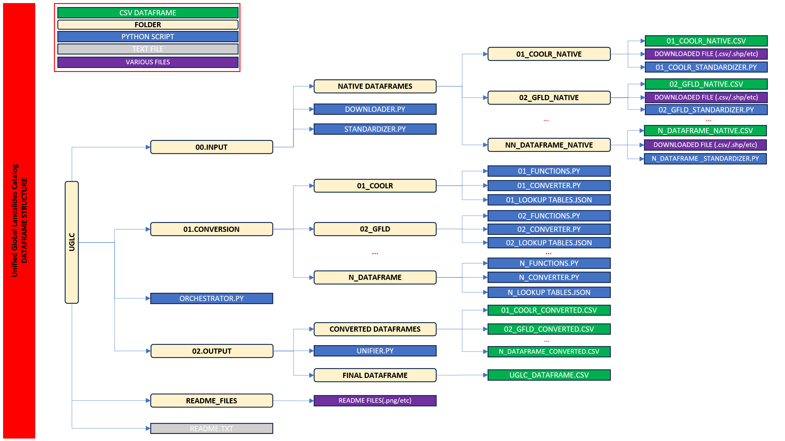

# <p align="center"> UGLC Project </p>
### <p align="center"> "Unified Global Landslides Catalog" </p>

----------------------------------------------------------------------------------------------------------------

----------------------------------------------------------------------------------------------------------------
                                                        IN PROGRESS
----------------------------------------------------------------------------------------------------------------


## <p align="center"> AUTHORS  </p>

----------------------------------------------------------------------------------------------------------------
- [@Saverio Mancino](https://github.com/RavyHollow) - PhD Student (University of Bari).
- [@Anna Sblano](https://github.com/Anita2333) - Researcher (University of Bari).
- [@Francesco Paolo Lovergine](https://github.com/fpl) - Researcher (CNR - IREA).
- [@Giuseppe Amatulli](https://github.com/selvaje) - PhD Researcher (Yale University).
- 


## <p align="center"> SUMMARY OF ATTRIBUTE FIELDS INCLUDED IN UGLC </p>

|        | WKT_GEOM          | NEW DATASET   | ID     | OLD DATASET   | OLD ID | VERSION   | COUNTRY   | ACCURACY   | START DATE   | END DATE   | TYPE     | TRIGGER | AFFIDABILITY | RPSV     | DPCM     | FATALITIES | INJURIES | NOTES  | LINK   |
|--------|-------------------|---------------|--------|---------------|--------|-----------|-----------|------------|--------------|------------|----------|---------|--------------|----------|----------|------------|----------|--------|--------|
| TYPE   | Well known text   | String        | Int    | String        | String | String    | String    | String     | Date         | Date       | String   | String  | Int          | Bool     | Bool     | Int        | Int      | String | String |
| STATUS | active            | Active        | Active | Active        | Active | Active    | Active    | Active     | Active       | Active     | Active   | Active  | Active       | Inactive | inactive | Active     | Active   | Active | Active |


### <p align="center"> ATTRIBUTES DESCRIPTION </p>

----------------------------------------------------------------------------------------------------------------
- <b> WKT_GEOM: </b> The contents of this field contain information about the georeferencing of each point described in the dataframe using the WGS84 reference system.
-----------
- <b> NEW DATASET: </b> the content of this field represents the name of the new dataframe's identifying abbreviation: "UGLC".
-----------
- <b> ID: </b> the content of this field represents the name of the new dataframe's identifying abbreviation: "UGLC".
-----------
  - <b> OLD DATASET: </b> the contents of this field represent the name of the native dataset using an identification abbreviation:

    - [01_COOLR](https://maps.nccs.nasa.gov/arcgis/apps/MapAndAppGallery/index.html?appid=574f26408683485799d02e857e5d9521):
        Cooperative Open Online Landslide Repository (NASA) (both Event Points and Report Points are used together, 
        eliminating overlapping points at same coordinates.
    
        <b>[TOTAL POINTS: 49718]</b>.  
    - [02_GFLD](https://maps.nccs.nasa.gov/arcgis/apps/MapAndAppGallery/index.html?appid=574f26408683485799d02e857e5d9521): 
        Global fatal landslide occurrence from 2004 to 2016 
    
        <b>[TOTAL POINTS: 5490]</b>. 

    - [03_ITALICA](https://zenodo.org/records/8009366): 
        ITAlian rainfall-induced LandslIdes CAtalogue (CNR - IRPI)

        <b>[TOTAL POINTS: 6312]</b>. 
    
    - [04_UAP](https://www.sciencebase.gov/catalog/item/61f326dfd34e622189b93308): 
        Landslide Inventories across the United States version2 (USGS)

        <b>[TOTAL POINTS: 6312]</b>. 

   ...

-----------
- <b> OLD ID: </b> 
-----------
- <b> VERSION: </b> 
-----------
- <b> COUNTRY: </b> 
-----------
- <b> ACCURACY: </b> 
-----------
- <b> START DATE: </b> 

formato:ISO 8601:YYYY/MM/DD

-----------
- <b> END DATE: </b> 

formato:ISO 8601:YYYY/MM/DD

-----------
- <b> TYPE: </b> 
-----------
- <b> TRIGGER: </b> 
-----------
- <b> AFFIDABILITY: </b> 
-----------
- <b> RPSV: </b> 
-----------
- <b> DCMV: </b> 
-----------
- <b> FATALITIES: </b> 
-----------
- <b> INJURIES: </b> 
-----------
- <b> NOTES: </b> 
-----------
- <b> LINKS: </b> 
-----------
ID: Unique ID for each landslide

OLD DATASET: Name of the Native dataset

OLD_ID: ID point of the Native dataset

VERSION: Version of the Native dataset

COUNTRY: Country of the point

ACCURACY[m]: Accuracy in metres   

START DATE: Date of the landslides , 

END DATE: Date of the landslides, format: ISO 8601: YYYY/MM/DD. If we have the exact date of the landslides we will have the start date = end date,
however if we only have the year or period of acquisition of the landslide we will have the start date different from the end date and therefore we
will have the interval in the time in which the landslide probably occurred

TYPE: Type of landsdlise if known and include: complex,soil creep,debris flow,earth flow,lahar,slide,mudslide,riverbank collapse,rock slide,rock fall,rotational slide,
translational slide,snow avalanche,not defined

TRIGGER:Type of trigger if known and include: rainfall,seismic,volcanic,human,climate,not defined

AFFIDABILITY: 1:exact point , 2:Almost exact point , 3:Very high reliability point, 4:High reliability point, 5:Medium reliability point, 6:Low reliability point,
7:Very low reliability point, 8:Poor reliability point, 9: Uncertain reliability point, 10:Not reliable point

PSV:

DCMV:

FATALITIES:

INJURIES:

NOTES:

LINK:


### <p align="center"> FOLDER STRUCTURE</p>
--------------------------------------------------------
--------------------------------------------------------



The entire UGLC structure is allocated in 3 main folders :
- 00.INPUT

      This folder contains the "DOWNLOADER.py" and "STANDARDIZER.py" scripts that allow the automatic download of 
      native datasets from the source sites (Entities, Government agencies, Universities, Various repositories etc.), the standardization of the file name 
      (NN_DATASETNAME_NATIVE.csv format) and allocation in the subfolder named "00.INPUT\NATIVE_DATAFRAMES\NN_DATASETNAME_NATIVE" 
      sub folder.

- 01.CONVERSION_CSV

      This folder contains the different folders named after the native datasets ("NN_DATASETNAME") within the
      "NN_CONVERTER.py," "NN_FUNCTIONS.py," and "NN_LOOKUPTABLES.json" scripts which allow the filtering of the native datasets
      and its conversion into a new dataset having the same format as the final UGLC dataframe, and will be allocated in 
      "02.OUTPUT\CONVERTED_DATAFRAMES" directory.

- 02.OUTPUT

      This folder contains the script "UNIFIER.py" that allows the union of all converted and adapted datasets 
      present in the  "02.OUTPUT\CONVERTED_DATAFRAMES" directory, into the final UGLC dataframe allocated into the "FINAL_DATAFRAME" folder.

All the scripts are commanded by the "ORCHESTRATOR.py" master script in the main folder "UGLC".

Into the main folder there is also the README.txt and the subfolder "README_FILES" wich contain all this informations and the 
pictures of the UGLC dataframe.

--------------------------------------------------------

# UGLC Project

Unified Global Landslides Catalog.
--------------------------------------------------------
                   IN PROGRESS
--------------------------------------------------------

## Descrizione

The UGLC project aims to create a global landslide catalog as a unified dataframe from multiple global, national and regional dataframes.
inside contains information from catalogs:
- 
-
-


## Requisiti

Specifica eventuali requisiti hardware o software necessari per eseguire gli script. Ad esempio:

- Python 3.6 o versioni successive
- Altri moduli o librerie specifici

## License
The code is published under the [MIT License](README_FILES/LICENSE.md).

## Installazione

Spiega come installare eventuali dipendenze o configurare l'ambiente di lavoro per eseguire gli script.

```bash
pip install -r requirements.txt
